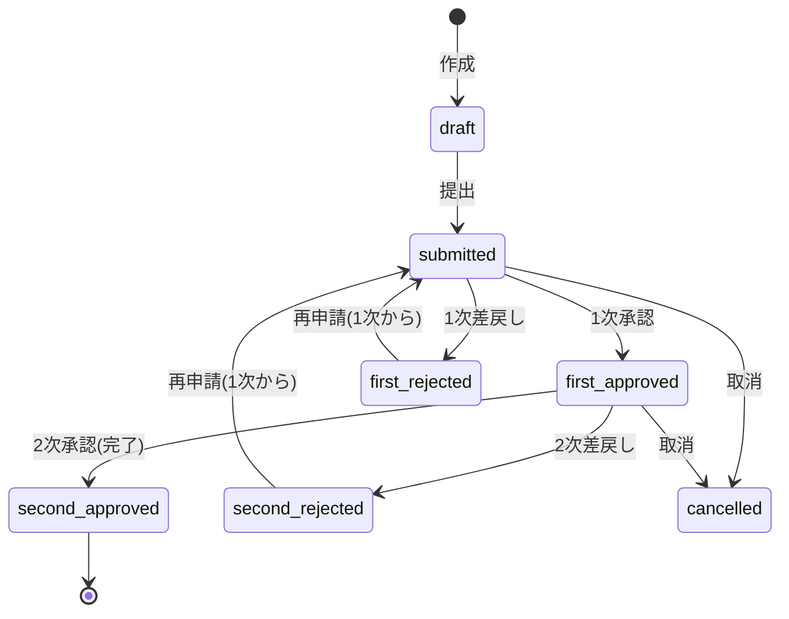

# ER図（全20テーブル）

SQLite は enum 非対応のため、列挙値は String + アプリ層（Zod）で制約しています。

```mermaid
erDiagram
  users ||--o{ attendance_records : has
  users ||--o{ pc_activity_logs : logs
  users ||--o{ applications : applies
  users ||--o{ paid_leave_balances : holds
  users ||--o{ notifications : receives
  users ||--o{ audit_logs : acts
  users ||--o{ monthly_attendance_closings : closes
  users }o--|| departments : belongs_to
  users }o--|| employment_types : typed_as
  users }o--o| users : first_approver
  users }o--o| users : second_approver

  departments ||--o{ users : contains
  employment_types ||--o{ users : classifies
  work_types ||--o{ attendance_records : categorizes

  attendance_records ||--o{ correction_requests : corrected_by

  applications ||--|| correction_requests : detail
  applications ||--o{ application_approval_steps : steps
  applications ||--o{ approval_comments : comments
  applications ||--o{ notifications : relates

  monthly_attendance_closings ||--o{ monthly_approval_logs : approvals

  occupational_health_reports ||--o{ occupational_health_report_items : items
  occupational_health_report_items ||--o{ occupational_physician_comments : comments
  occupational_health_report_items ||--|| medical_review_statuses : review
  occupational_health_report_items }o--o| departments : dept

  users ||--o{ labor_risk_alerts : flagged

  users {
    string id PK
    string employeeCode UK
    string email UK
    string passwordHash
    string name
    string role "employee|first_approver|second_approver|admin|occupational_physician"
    boolean isActive
    string departmentId FK
    string employmentTypeId FK
    string firstApproverId FK
    string secondApproverId FK
  }
  departments { string id PK; string code UK; string name }
  employment_types { string id PK; string code UK; string name }
  work_types { string id PK; string code UK; string name; boolean isHoliday }

  attendance_records {
    string id PK
    string userId FK
    datetime workDate
    datetime clockIn
    datetime clockOut
    int breakMinutes
    string workTypeId FK
    int workMinutes
    int overtimeMinutes
    int nightMinutes
    boolean isHolidayWork
    string source "auto|manual"
    string status "unconfirmed|needs_review|normal|locked"
    boolean locked
  }
  pc_activity_logs {
    string id PK
    string userId FK
    string terminalId
    string eventType "startup|shutdown|logon|logoff"
    datetime occurredAt
    string ipAddress
    string rawPayload
  }

  applications {
    string id PK
    string applicationType "paid_leave|training|business_trip|correction"
    string applicantId FK
    string title
    datetime targetStartAt
    datetime targetEndAt
    string content
    string expectedEffect
    string attachmentPath
    string comment
    string status
    int currentStepLevel
    int resubmitCount
    string firstApproverId
    string secondApproverId
  }
  correction_requests {
    string id PK
    string applicationId FK,UK
    string attendanceRecordId FK
    datetime beforeClockIn
    datetime afterClockIn
    datetime beforeClockOut
    datetime afterClockOut
    int beforeBreakMinutes
    int afterBreakMinutes
    string reason
  }
  application_approval_steps {
    string id PK
    string applicationId FK
    int stepLevel "1|2"
    string approverId FK
    string decision "pending|approved|rejected"
    string comment
    datetime decidedAt
  }
  approval_comments {
    string id PK
    string applicationId FK
    string authorId FK
    string body
    string kind "comment|approve|reject|resubmit"
  }
  notifications {
    string id PK
    string userId FK
    string type
    string title
    string body
    string linkUrl
    string channel "in_app|email"
    boolean isRead
    datetime emailSentAt
  }
  audit_logs {
    string id PK
    string actorId FK
    string action
    string entityType
    string entityId
    string beforeJson
    string afterJson
    string ipAddress
  }
  paid_leave_balances {
    string id PK
    string userId FK
    int fiscalYear
    float grantedDays
    float usedDays
  }
  monthly_attendance_closings {
    string id PK
    string userId FK
    int year
    int month
    int attendanceDays
    int totalWorkMinutes
    int overtimeMinutes
    int nightMinutes
    int holidayWorkDays
    float paidLeaveDays
    string status "open|submitted|first_approved|second_approved|locked|reopened"
    boolean locked
  }
  monthly_approval_logs {
    string id PK
    string closingId FK
    int stepLevel
    string approverId FK
    string decision
    datetime decidedAt
  }
  occupational_health_reports {
    string id PK
    int year
    int month
    string generatedById FK
    string status "draft|shared"
    datetime sharedAt
    string note
  }
  occupational_health_report_items {
    string id PK
    string reportId FK
    string userId FK
    string departmentId FK
    int totalWorkMinutes
    int overtimeMinutes
    int nightMinutes
    int holidayWorkDays
    float paidLeaveDays
    boolean over45
    boolean over80
    boolean interviewCandidate
  }
  occupational_physician_comments {
    string id PK
    string reportItemId FK
    string physicianId FK
    string body
  }
  medical_review_statuses {
    string id PK
    string reportItemId FK,UK
    string status "pending|shared|physician_reviewed"
    string reviewedByPhysicianId
    datetime reviewedAt
  }
  labor_risk_alerts {
    string id PK
    string userId FK
    string alertType "over45|over80|consecutive_long|night_increase|holiday_increase|low_paid_leave|month_unconfirmed|approval_delay"
    string severity "info|warning|critical"
    int year
    int month
    string message
    boolean isResolved
  }
```

## 申請ステータス状態遷移


