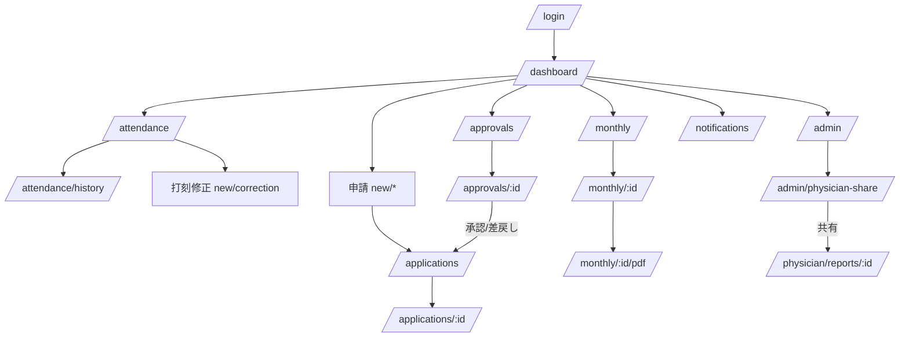

# 画面一覧・画面遷移

## 画面一覧

| 画面 | ルート | ロール | 備考 |
| --- | --- | --- | --- |
| ログイン | `/login` | 全 | メール+PW、Entra SSO枠 |
| ダッシュボード | `/dashboard` | 従業員/承認者/管理 | ロール別カード |
| 勤怠登録 | `/attendance` | 全(業務) | 自動打刻表示・手動修正 |
| 勤怠履歴 | `/attendance/history` | 全(業務) | 月次テーブル・月切替 |
| 月次勤怠（一覧） | `/monthly` | 全(業務) | 自分の月次＋承認待ち |
| 月次勤怠（詳細/確定/承認） | `/monthly/[id]` | 本人/承認者/管理 | 確定申請・電子承認・再オープン |
| 月次勤怠表PDF | `/monthly/[id]/pdf` | 本人/承認者/管理 | 印刷→PDF |
| 有給休暇申請 | `/applications/new/paid_leave` | 従業員他 | |
| 研修申請 | `/applications/new/training` | 従業員他 | |
| 出張申請 | `/applications/new/business_trip` | 従業員他 | |
| 打刻修正申請 | `/applications/new/correction` | 従業員他 | 対象勤怠選択・前後比較 |
| 申請ステータス一覧 | `/applications` | 当事者 | |
| 申請詳細 | `/applications/[id]` | 本人/管理 | 取消・再申請 |
| 承認待ち一覧 | `/approvals` | 承認者/管理 | 自分のターンのみ |
| 申請詳細・承認 | `/approvals/[id]` | 承認者/管理 | 承認カード(14.8)・承認/差戻し |
| 承認履歴 | `/approvals/history` | 承認者/管理 | |
| 通知センター | `/notifications` | 全 | 未読バッジ・既読 |
| 管理チームダッシュボード | `/admin` | 管理 | 15.9のカード群 |
| 長時間労働アラート一覧 | `/admin/alerts` | 管理 | CSV出力 |
| 産業医共有対象者一覧 | `/admin/physician-share` | 管理 | レポート生成・共有・CSV |
| 従業員マスタ | `/admin/users` | 管理 | 作成・ロール/承認者編集・有効無効 |
| マスタ設定 | `/admin/settings` | 管理 | 部門/雇用区分/勤務区分 |
| 産業医ダッシュボード | `/physician` | 産業医 | 面談候補者 |
| 産業医 共有レポート一覧 | `/physician/reports` | 産業医 | |
| 産業医 向け閲覧/コメント/確認 | `/physician/reports/[id]` | 産業医 | 最小権限・コメント・確認済み |

## 画面遷移（概略）

